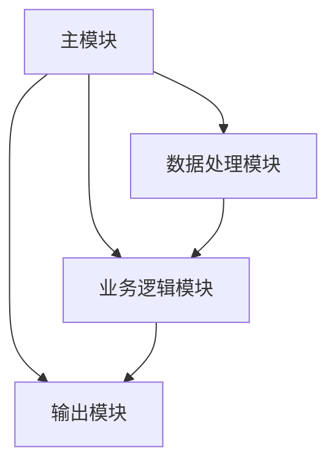

# 设计框架生成命令

## 使用方法

在项目根目录运行: `/.design-framework`

## 功能描述

通过交互式交流收集项目信息，生成完整的项目设计/更新项目设计框架，包括：

- 项目整体架构图（Mermaid格式）
- 各模块详细逻辑图（Mermaid格式）
- 主函数和子模块伪代码
- 完整的文件夹结构
- 系统完整 ERD 图（实体关系图，展示所有模块及其参数、关系）

## 生成的文件结构

```
.project_design/
├── README.md                    # 项目总体设计说明
├── system_erd.md               # 系统完整 ERD 图（在根目录下，使用 Mermaid ERD 语法）
├── main_framework.md           # 主函数设计
└── modules/
    ├── {module1}/
    │   ├── design.md           # 模块设计说明（【补充】包含参数定义和关系说明）
    │   ├── logic_flow.md       # 逻辑流程图
    │   └── pseudocode.md       # 详细伪代码
    └── {module2}/
        ├── design.md
        ├── logic_flow.md
        └── pseudocode.md
```

## 交互问题模板

系统会询问以下问题来收集设计信息：

### 1. 项目基本信息

- 项目名称和目标
- 主要功能需求
- 技术栈选择

### 2. 模块划分

- 核心功能模块
- 模块间的依赖关系
- 数据流向
- 每个模块的参数定义（包括内部变量、配置参数、数据类型、默认值、说明）
- 每个模块与其他模块的明确关系（如调用关系、数据依赖、关系类型、数据流向）

### 3. 实现细节

- 每个模块的核心逻辑
- 关键算法和数据结构
- 接口设计

### 4. 架构决策

- 整体架构模式
- 设计原则和约束
- 扩展性考虑

## 输出格式

- 所有图表使用 Mermaid 语法
- 伪代码使用中文注释
- Markdown 格式，便于版本控制
- 支持直接粘贴到文档中
- ERD 图使用 Mermaid ERD 语法，在 system_erd.md 中生成，展示每个模块作为实体（包含参数定义）、模块间关系（用连线表示依赖类型）。

## 示例输出



ERD 示例输出（在 system_erd.md 中）：

````mermaid
erDiagram
    MODULE_A {
        string module_id PK
        string module_name
        string module_type
        int priority
        timestamp created_at
    }
    
    MODULE_B {
        string module_id PK
        string parent_module FK
        string status
        json config_params
    }
    
    MODULE_A ||--o{ MODULE_B : "depends_on"
````

