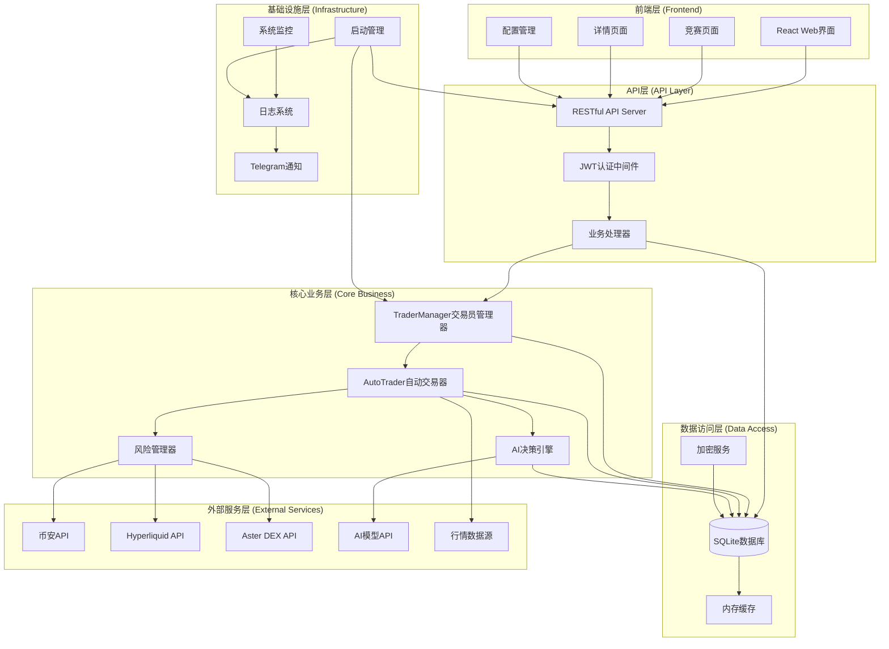

# NOFX 主框架设计

## 系统整体架构



## 主函数伪代码

```go
// 主函数 - 系统启动入口
func main() {
    // 1. 显示启动横幅
    displayStartupBanner()

    // 2. 加载环境变量
    loadEnvironmentVariables()

    // 3. 初始化配置系统
    config := initializeConfiguration()

    // 4. 初始化数据库
    database := initializeDatabase(config.DatabasePath)
    defer database.Close()

    // 5. 初始化加密服务
    cryptoService := initializeCryptoService()
    database.SetCryptoService(cryptoService)

    // 6. 同步配置文件到数据库
    syncConfigToDatabase(config, database)

    // 7. 加载内测码到数据库
    loadBetaCodesToDatabase(database)

    // 8. 初始化认证系统
    initializeAuthentication(config.JWTSecret)

    // 9. 获取系统配置
    systemConfig := loadSystemConfiguration(database)

    // 10. 设置默认币种列表
    setupDefaultCoins(database, systemConfig)

    // 11. 创建交易员管理器
    traderManager := manager.NewTraderManager()

    // 12. 从数据库加载所有交易员配置
    loadTradersFromDatabase(traderManager, database)

    // 13. 显示已加载的交易员信息
    displayLoadedTraders(database)

    // 14. 创建并启动API服务器
    apiServer := startAPIServer(traderManager, database, cryptoService, config)

    // 15. 启动行情数据监控
    startMarketDataMonitoring(database)

    // 16. 设置优雅退出
    setupGracefulShutdown(traderManager, apiServer, database)

    // 17. 等待退出信号
    waitForShutdownSignal()
}
```

## 核心初始化流程伪代码

```go
// 数据库初始化
func initializeDatabase(dbPath string) *config.Database {
    log.Printf("📋 初始化配置数据库: %s", dbPath)
    database, err := config.NewDatabase(dbPath)
    if err != nil {
        log.Fatalf("❌ 初始化数据库失败: %v", err)
    }
    log.Printf("✅ 数据库初始化成功")
    return database
}

// 加密服务初始化
func initializeCryptoService() *crypto.CryptoService {
    log.Printf("🔐 初始化加密服务...")
    cryptoService, err := crypto.NewCryptoService("secrets/rsa_key")
    if err != nil {
        log.Fatalf("❌ 初始化加密服务失败: %v", err)
    }
    log.Printf("✅ 加密服务初始化成功")
    return cryptoService
}

// 交易员管理器初始化
func initializeTraderManager(database *config.Database) *manager.TraderManager {
    traderManager := manager.NewTraderManager()

    // 从数据库加载所有交易员到内存
    err := traderManager.LoadTradersFromDatabase(database)
    if err != nil {
        log.Fatalf("❌ 加载交易员失败: %v", err)
    }

    log.Printf("✓ 交易员管理器初始化成功")
    return traderManager
}

// API服务器启动
func startAPIServer(traderManager *manager.TraderManager, database *config.Database,
                   cryptoService *crypto.CryptoService, apiPort int) *api.Server {
    // 创建API服务器
    apiServer := api.NewServer(traderManager, database, cryptoService, apiPort, false)

    // 在单独的goroutine中启动API服务器
    go func() {
        if err := apiServer.Start(); err != nil {
            log.Printf("❌ API服务器错误: %v", err)
        }
    }()

    log.Printf("🌐 API服务器启动在端口 %d", apiPort)
    return apiServer
}

// 行情监控启动
func startMarketDataMonitoring(database *config.Database) {
    // 获取自定义币种列表
    customCoins := database.GetCustomCoins()
    log.Printf("📋 从数据库获取的币种列表: %d 个币种 %v", len(customCoins), customCoins)

    // 启动WebSocket行情监控
    go market.NewWSMonitor(150).Start(customCoins)
    log.Printf("📊 行情数据监控已启动")
}
```

## 优雅退出流程伪代码

```go
// 优雅退出处理
func setupGracefulShutdown(traderManager *manager.TraderManager, apiServer *api.Server, database *config.Database) {
    // 设置信号监听
    sigChan := make(chan os.Signal, 1)
    signal.Notify(sigChan, os.Interrupt, syscall.SIGTERM)

    // 等待退出信号
    <-sigChan

    log.Println("📛 收到退出信号，正在优雅关闭...")

    // 1. 停止所有交易员
    log.Println("⏸️  停止所有交易员...")
    traderManager.StopAll()
    log.Println("✅ 所有交易员已停止")

    // 2. 关闭API服务器
    log.Println("🛑 停止API服务器...")
    if err := apiServer.Shutdown(); err != nil {
        log.Printf("⚠️  关闭API服务器时出错: %v", err)
    } else {
        log.Println("✅ API服务器已安全关闭")
    }

    // 3. 关闭数据库连接
    log.Println("💾 关闭数据库连接...")
    if err := database.Close(); err != nil {
        log.Printf("❌ 关闭数据库失败: %v", err)
    } else {
        log.Println("✅ 数据库已安全关闭，所有数据已持久化")
    }

    log.Println("👋 感谢使用AI交易系统！")
}
```

## 系统启动参数说明

### 命令行参数
- **数据库路径**: 可通过命令行参数指定数据库文件路径
- **环境变量**: 支持通过环境变量配置JWT密钥、API端口等

### 配置加载优先级
1. **环境变量** (最高优先级)
2. **数据库配置** (中等优先级)
3. **config.json文件** (最低优先级)
4. **默认值** (兜底值)

### 核心组件启动顺序
1. 数据库系统 → 确保数据持久化可用
2. 加密服务 → 确保敏感信息安全
3. 认证系统 → 确保API访问安全
4. 交易员管理器 → 加载交易策略
5. API服务器 → 提供Web接口
6. 行情监控 → 获取市场数据

### 错误处理策略
- **致命错误**: 直接终止程序，记录详细日志
- **非致命错误**: 记录警告，继续运行其他组件
- **组件失败**: 尝试降级运行，必要时重启组件