# 回测系统逻辑流程图

## 回测系统启动流程

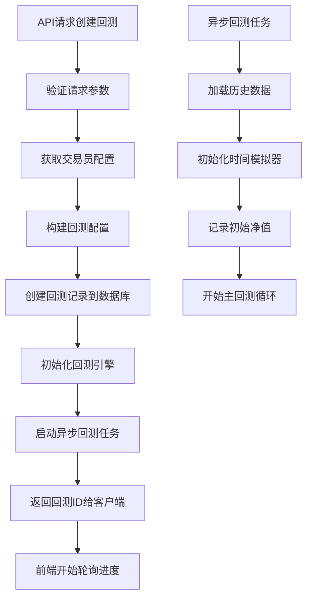
```mermaid
flowchart TD
    A[API请求创建回测] --> B[验证请求参数]
    B --> C[获取交易员配置]
    C --> D[构建回测配置]
    D --> E[创建回测记录到数据库]
    E --> F[初始化回测引擎]
    F --> G[启动异步回测任务]
    G --> H[返回回测ID给客户端]
    H --> I[前端开始轮询进度]

    J[异步回测任务] --> K[加载历史数据]
    K --> L[初始化时间模拟器]
    L --> M[记录初始净值]
    M --> N[开始主回测循环]
```

## 历史数据加载流程

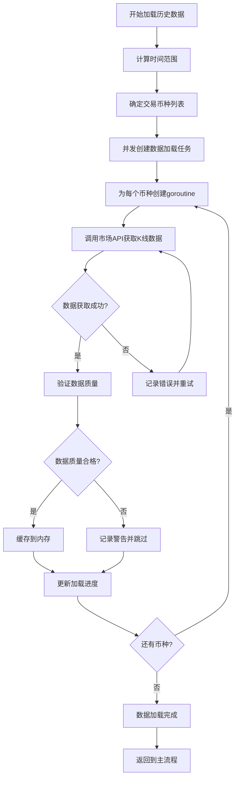
```mermaid
flowchart TD
    A[开始加载历史数据] --> B[计算时间范围]
    B --> C[确定交易币种列表]
    C --> D[并发创建数据加载任务]
    D --> E[为每个币种创建goroutine]
    E --> F[调用市场API获取K线数据]
    F --> G{数据获取成功?}
    G -->|是| H[验证数据质量]
    G -->|否| I[记录错误并重试]
    I --> F
    H --> J{数据质量合格?}
    J -->|是| K[缓存到内存]
    J -->|否| L[记录警告并跳过]
    K --> M[更新加载进度]
    L --> M
    M --> N{还有币种?}
    N -->|是| E
    N -->|否| O[数据加载完成]
    O --> P[返回到主流程]
```

## 主回测循环流程

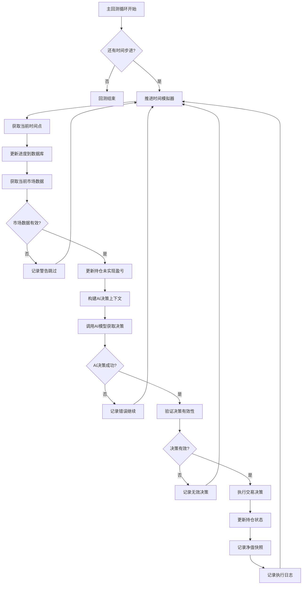
```mermaid
flowchart TD
    A[主回测循环开始] --> B{还有时间步进?}
    B -->|否| C[回测结束]
    B -->|是| D[推进时间模拟器]
    D --> E[获取当前时间点]
    E --> F[更新进度到数据库]
    F --> G[获取当前市场数据]
    G --> H{市场数据有效?}
    H -->|否| I[记录警告跳过]
    H -->|是| J[更新持仓未实现盈亏]
    I --> D
    J --> K[构建AI决策上下文]
    K --> L[调用AI模型获取决策]
    L --> M{AI决策成功?}
    M -->|否| N[记录错误继续]
    M -->|是| O[验证决策有效性]
    N --> D
    O --> P{决策有效?}
    P -->|否| Q[记录无效决策]
    P -->|是| R[执行交易决策]
    Q --> D
    R --> S[更新持仓状态]
    S --> T[记录净值快照]
    T --> U[记录执行日志]
    U --> D
```

## AI决策获取流程

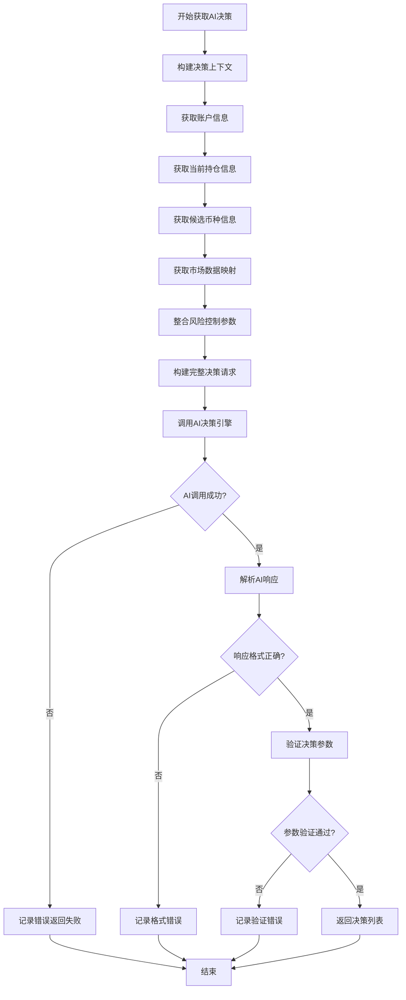
```mermaid
flowchart TD
    A[开始获取AI决策] --> B[构建决策上下文]
    B --> C[获取账户信息]
    C --> D[获取当前持仓信息]
    D --> E[获取候选币种信息]
    E --> F[获取市场数据映射]
    F --> G[整合风险控制参数]
    G --> H[构建完整决策请求]
    H --> I[调用AI决策引擎]
    I --> J{AI调用成功?}
    J -->|否| K[记录错误返回失败]
    J -->|是| L[解析AI响应]
    L --> M{响应格式正确?}
    M -->|否| N[记录格式错误]
    M -->|是| O[验证决策参数]
    O --> P{参数验证通过?}
    P -->|否| Q[记录验证错误]
    P -->|是| R[返回决策列表]
    K --> S[结束]
    N --> S
    Q --> S
    R --> S
```

## 交易决策执行流程

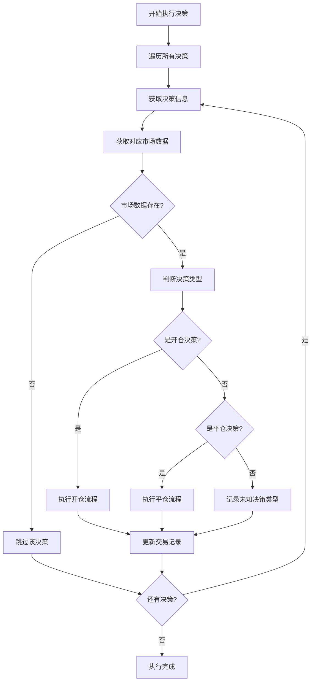
```mermaid
flowchart TD
    A[开始执行决策] --> B[遍历所有决策]
    B --> C[获取决策信息]
    C --> D[获取对应市场数据]
    D --> E{市场数据存在?}
    E -->|否| F[跳过该决策]
    E -->|是| G[判断决策类型]
    G --> H{是开仓决策?}
    H -->|是| I[执行开仓流程]
    H -->|否| J{是平仓决策?}
    J -->|是| K[执行平仓流程]
    J -->|否| L[记录未知决策类型]
    K --> M[更新交易记录]
    I --> M
    L --> M
    M --> N{还有决策?}
    N -->|是| C
    N -->|否| O[执行完成]
    F --> N
```

## 开仓执行流程

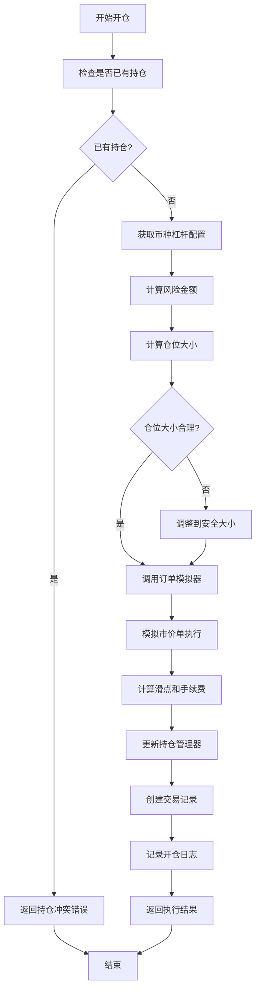
```mermaid
flowchart TD
    A[开始开仓] --> B[检查是否已有持仓]
    B --> C{已有持仓?}
    C -->|是| D[返回持仓冲突错误]
    C -->|否| E[获取币种杠杆配置]
    E --> F[计算风险金额]
    F --> G[计算仓位大小]
    G --> H{仓位大小合理?}
    H -->|否| I[调整到安全大小]
    H -->|是| J[调用订单模拟器]
    I --> J
    J --> K[模拟市价单执行]
    K --> L[计算滑点和手续费]
    L --> M[更新持仓管理器]
    M --> N[创建交易记录]
    N --> O[记录开仓日志]
    O --> P[返回执行结果]
    D --> Q[结束]
    P --> Q
```

## 平仓执行流程

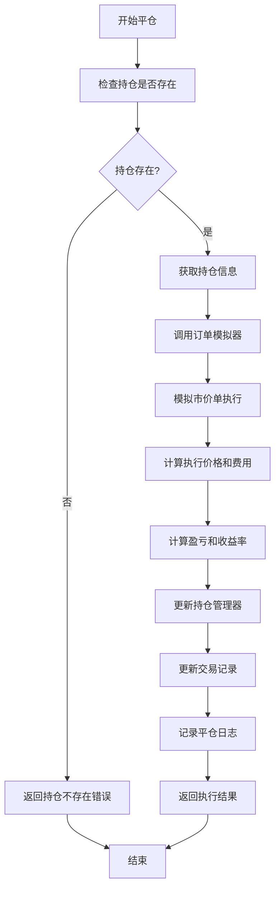
```mermaid
flowchart TD
    A[开始平仓] --> B[检查持仓是否存在]
    B --> C{持仓存在?}
    C -->|否| D[返回持仓不存在错误]
    C -->|是| E[获取持仓信息]
    E --> F[调用订单模拟器]
    F --> G[模拟市价单执行]
    G --> H[计算执行价格和费用]
    H --> I[计算盈亏和收益率]
    I --> J[更新持仓管理器]
    J --> K[更新交易记录]
    K --> L[记录平仓日志]
    L --> M[返回执行结果]
    D --> N[结束]
    M --> N
```

## 持仓管理流程

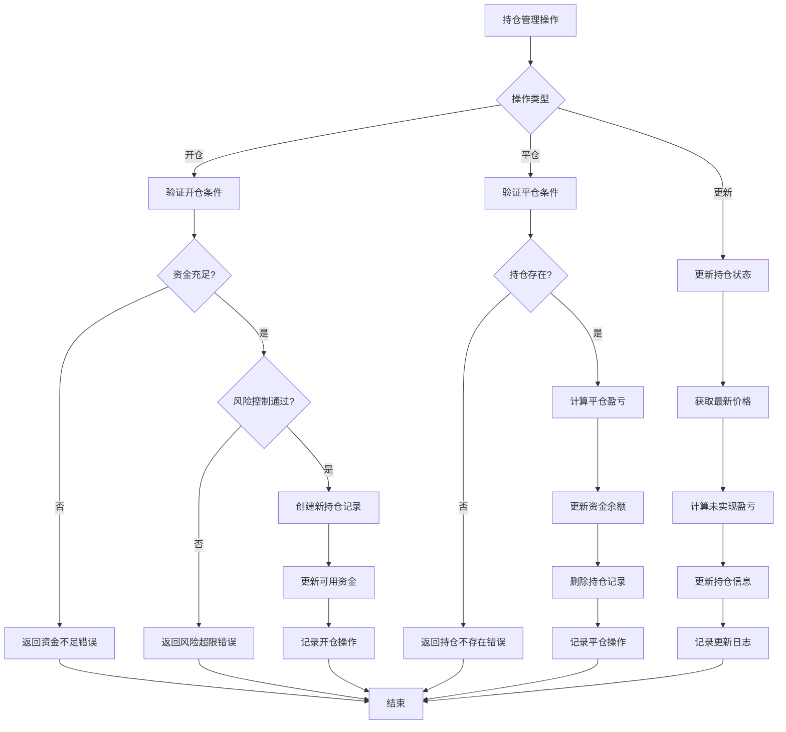
```mermaid
flowchart TD
    A[持仓管理操作] --> B{操作类型}
    B -->|开仓| C[验证开仓条件]
    B -->|平仓| D[验证平仓条件]
    B -->|更新| E[更新持仓状态]

    C --> F{资金充足?}
    F -->|否| G[返回资金不足错误]
    F -->|是| H{风险控制通过?}
    H -->|否| I[返回风险超限错误]
    H -->|是| J[创建新持仓记录]
    J --> K[更新可用资金]
    K --> L[记录开仓操作]

    D --> M{持仓存在?}
    M -->|否| N[返回持仓不存在错误]
    M -->|是| O[计算平仓盈亏]
    O --> P[更新资金余额]
    P --> Q[删除持仓记录]
    Q --> R[记录平仓操作]

    E --> S[获取最新价格]
    S --> T[计算未实现盈亏]
    T --> U[更新持仓信息]
    U --> V[记录更新日志]

    G --> W[结束]
    I --> W
    L --> W
    N --> W
    R --> W
    V --> W
```

## 订单模拟流程

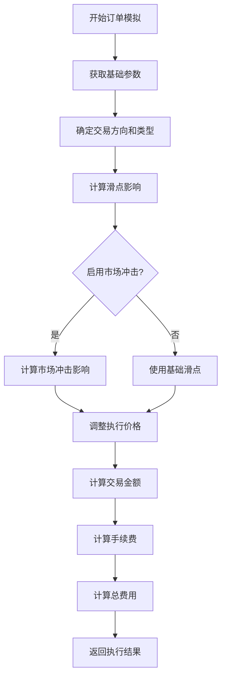
```mermaid
flowchart TD
    A[开始订单模拟] --> B[获取基础参数]
    B --> C[确定交易方向和类型]
    C --> D[计算滑点影响]
    D --> E{启用市场冲击?}
    E -->|是| F[计算市场冲击影响]
    E -->|否| G[使用基础滑点]
    F --> H[调整执行价格]
    G --> H
    H --> I[计算交易金额]
    I --> J[计算手续费]
    J --> K[计算总费用]
    K --> L[返回执行结果]
```

## 性能计算流程

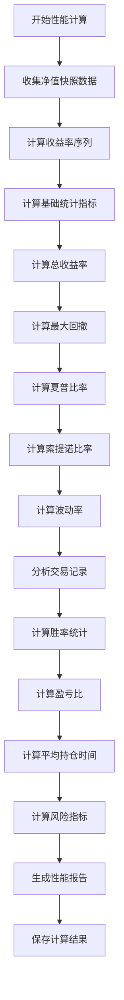
```mermaid
flowchart TD
    A[开始性能计算] --> B[收集净值快照数据]
    B --> C[计算收益率序列]
    C --> D[计算基础统计指标]
    D --> E[计算总收益率]
    E --> F[计算最大回撤]
    F --> G[计算夏普比率]
    G --> H[计算索提诺比率]
    H --> I[计算波动率]
    I --> J[分析交易记录]
    J --> K[计算胜率统计]
    K --> L[计算盈亏比]
    L --> M[计算平均持仓时间]
    M --> N[计算风险指标]
    N --> O[生成性能报告]
    O --> P[保存计算结果]
```

## 结果保存流程

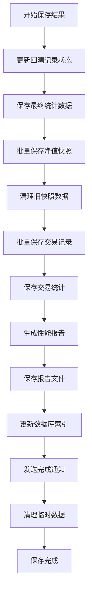
```mermaid
flowchart TD
    A[开始保存结果] --> B[更新回测记录状态]
    B --> C[保存最终统计数据]
    C --> D[批量保存净值快照]
    D --> E[清理旧快照数据]
    E --> F[批量保存交易记录]
    F --> G[保存交易统计]
    G --> H[生成性能报告]
    H --> I[保存报告文件]
    I --> J[更新数据库索引]
    J --> K[发送完成通知]
    K --> L[清理临时数据]
    L --> M[保存完成]
```

## 错误处理流程

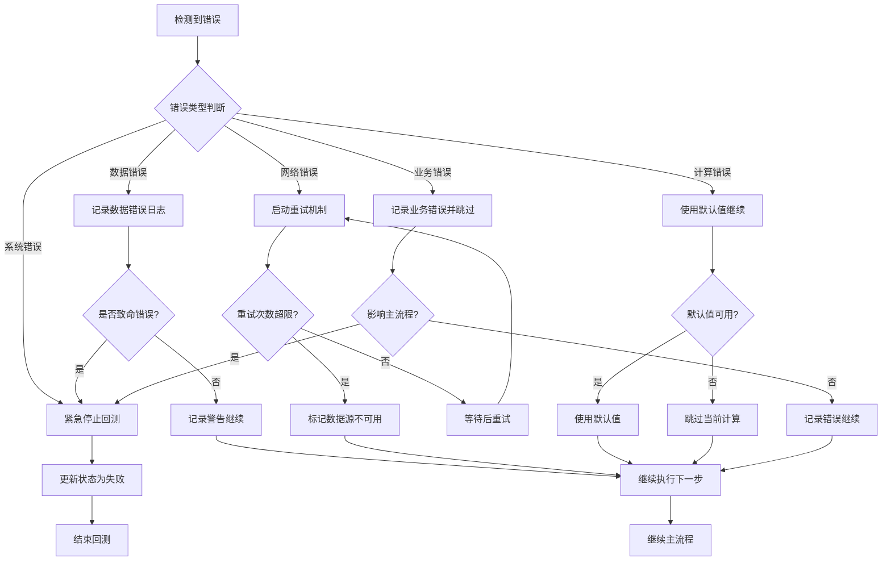
```mermaid
flowchart TD
    A[检测到错误] --> B{错误类型判断}
    B -->|数据错误| C[记录数据错误日志]
    B -->|网络错误| D[启动重试机制]
    B -->|计算错误| E[使用默认值继续]
    B -->|业务错误| F[记录业务错误并跳过]
    B -->|系统错误| G[紧急停止回测]

    C --> H{是否致命错误?}
    D --> I{重试次数超限?}
    E --> J{默认值可用?}
    F --> K{影响主流程?}

    H -->|是| G
    H -->|否| L[记录警告继续]
    I -->|是| M[标记数据源不可用]
    I -->|否| N[等待后重试]
    J -->|是| O[使用默认值]
    J -->|否| P[跳过当前计算]
    K -->|是| G
    K -->|否| Q[记录错误继续]

    G --> R[更新状态为失败]
    L --> S[继续执行下一步]
    M --> S
    N --> D
    O --> S
    P --> S
    Q --> S
    R --> T[结束回测]
    S --> U[继续主流程]
```