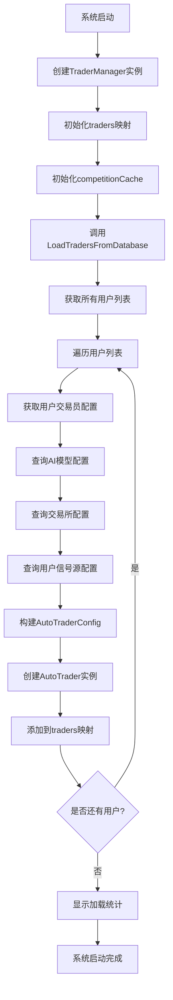
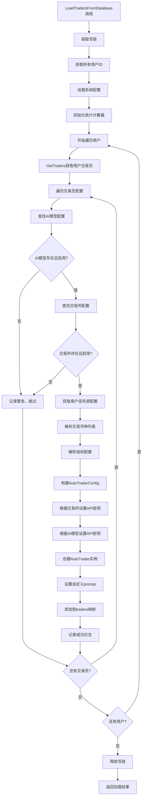
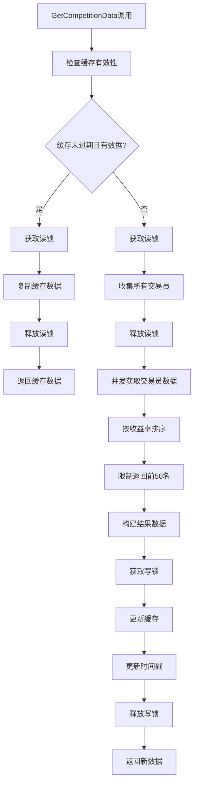
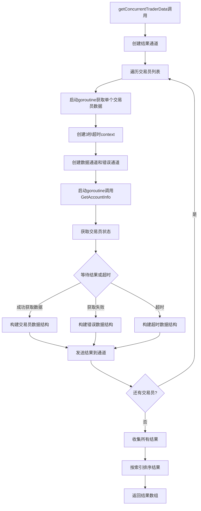
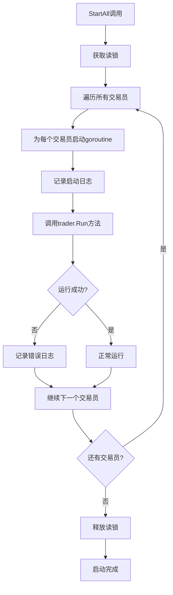
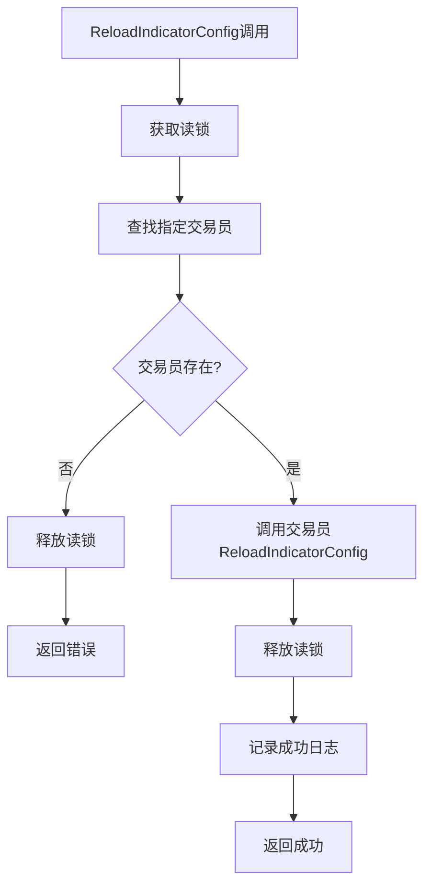
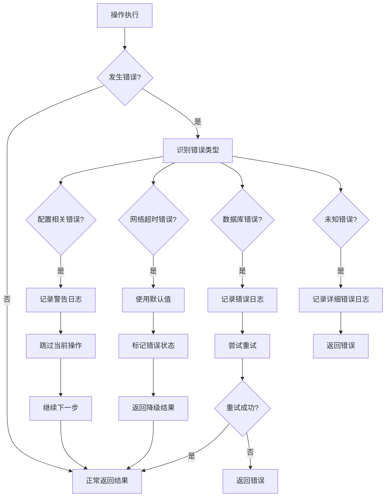

# 交易员管理器逻辑流程图

## 系统启动流程

```mermaid
flowchart TD
    A[系统启动] --> B[创建TraderManager实例]
    B --> C[初始化traders映射]
    C --> D[初始化competitionCache]
    D --> E[调用LoadTradersFromDatabase]
    E --> F[获取所有用户列表]
    F --> G[遍历用户列表]
    G --> H[获取用户交易员配置]
    H --> I[查询AI模型配置]
    I --> J[查询交易所配置]
    J --> K[查询用户信号源配置]
    K --> L[构建AutoTraderConfig]
    L --> M[创建AutoTrader实例]
    M --> N[添加到traders映射]
    N --> O{是否还有用户?}
    O -->|是| G
    O -->|否| P[显示加载统计]
    P --> Q[系统启动完成]
```

## 交易员加载流程

```mermaid
flowchart TD
    A[LoadTradersFromDatabase调用] --> B[获取写锁]
    B --> C[获取所有用户ID]
    C --> D[加载系统配置]
    D --> E[初始化统计计数器]
    E --> F[开始遍历用户]
    F --> G[GetTraders获取用户交易员]
    G --> H[遍历交易员配置]
    H --> I[查找AI模型配置]
    I --> J{AI模型存在且启用?}
    J -->|否| K[记录警告，跳过]
    J -->|是| L[查找交易所配置]
    L --> M{交易所存在且启用?}
    M -->|否| K
    M -->|是| N[获取用户信号源配置]
    N --> O[解析交易币种列表]
    O --> P[解析指标配置]
    P --> Q[构建AutoTraderConfig]
    Q --> R[根据交易所设置API密钥]
    R --> S[根据AI模型设置API密钥]
    S --> T[创建AutoTrader实例]
    T --> U[设置自定义prompt]
    U --> V[添加到traders映射]
    V --> W[记录成功日志]
    W --> X{还有交易员?}
    X -->|是| H
    X -->|否| Y{还有用户?}
    Y -->|是| F
    Y -->|否| Z[释放写锁]
    Z --> AA[返回加载结果]
    K --> X
```

## 竞赛数据获取流程

```mermaid
flowchart TD
    A[GetCompetitionData调用] --> B[检查缓存有效性]
    B --> C{缓存未过期且有数据?}
    C -->|是| D[获取读锁]
    D --> E[复制缓存数据]
    E --> F[释放读锁]
    F --> G[返回缓存数据]
    C -->|否| H[获取读锁]
    H --> I[收集所有交易员]
    I --> J[释放读锁]
    J --> K[并发获取交易员数据]
    K --> L[按收益率排序]
    L --> M[限制返回前50名]
    M --> N[构建结果数据]
    N --> O[获取写锁]
    O --> P[更新缓存]
    P --> Q[更新时间戳]
    Q --> R[释放写锁]
    R --> S[返回新数据]
```

## 并发数据获取流程

```mermaid
flowchart TD
    A[getConcurrentTraderData调用] --> B[创建结果通道]
    B --> C[遍历交易员列表]
    C --> D[启动goroutine获取单个交易员数据]
    D --> E[创建3秒超时context]
    E --> F[创建数据通道和错误通道]
    F --> G[启动goroutine调用GetAccountInfo]
    G --> H[获取交易员状态]
    H --> I{等待结果或超时}
    I -->|成功获取数据| J[构建交易员数据结构]
    I -->|获取失败| K[构建错误数据结构]
    I -->|超时| L[构建超时数据结构]
    J --> M[发送结果到通道]
    K --> M
    L --> M
    M --> N{还有交易员?}
    N -->|是| C
    N -->|否| O[收集所有结果]
    O --> P[按索引排序结果]
    P --> Q[返回结果数组]
```

## 交易员启动流程

```mermaid
flowchart TD
    A[StartAll调用] --> B[获取读锁]
    B --> C[遍历所有交易员]
    C --> D[为每个交易员启动goroutine]
    D --> E[记录启动日志]
    E --> F[调用trader.Run方法]
    F --> G{运行成功?}
    G -->|否| H[记录错误日志]
    G -->|是| I[正常运行]
    H --> J[继续下一个交易员]
    I --> J
    J --> K{还有交易员?}
    K -->|是| C
    K -->|否| L[释放读锁]
    L --> M[启动完成]
```

## 配置热重载流程

```mermaid
flowchart TD
    A[ReloadIndicatorConfig调用] --> B[获取读锁]
    B --> C[查找指定交易员]
    C --> D{交易员存在?}
    D -->|否| E[释放读锁]
    E --> F[返回错误]
    D -->|是| G[调用交易员ReloadIndicatorConfig]
    G --> H[释放读锁]
    H --> I[记录成功日志]
    I --> J[返回成功]
```

## 错误处理流程

```mermaid
flowchart TD
    A[操作执行] --> B{发生错误?}
    B -->|否| C[正常返回结果]
    B -->|是| D[识别错误类型]
    D --> E{配置相关错误?}
    E -->|是| F[记录警告日志]
    F --> G[跳过当前操作]
    G --> H[继续下一步]
    D --> I{网络超时错误?}
    I -->|是| J[使用默认值]
    J --> K[标记错误状态]
    K --> L[返回降级结果]
    D --> M{数据库错误?}
    M -->|是| N[记录错误日志]
    N --> O[尝试重试]
    O --> P{重试成功?}
    P -->|是| C
    P -->|否| Q[返回错误]
    D --> R{未知错误?}
    R -->|是| S[记录详细错误日志]
    S --> T[返回错误]
    H --> C
    L --> C
```